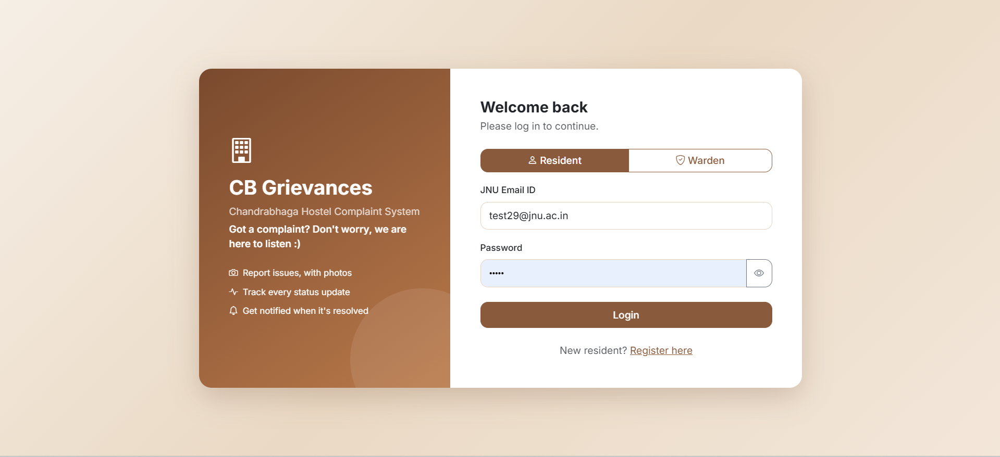
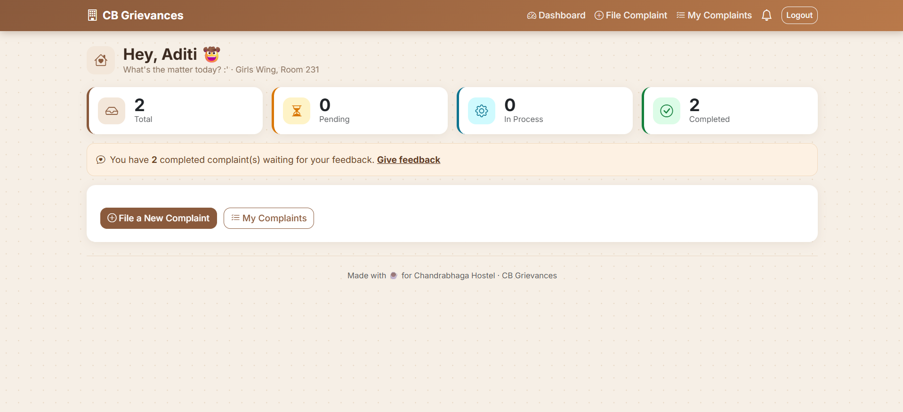
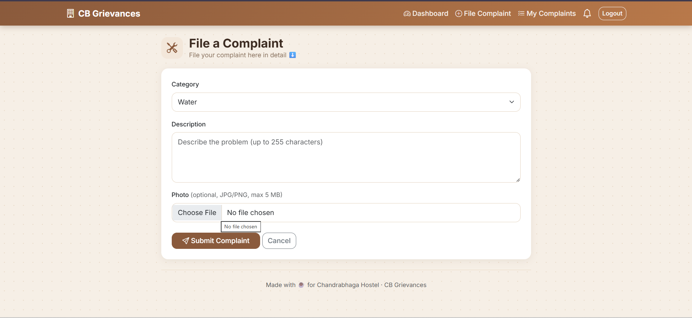
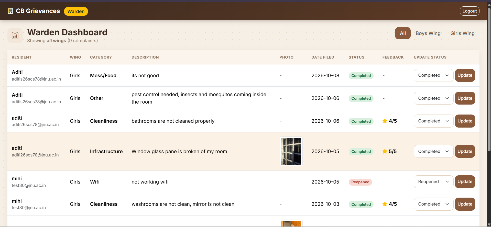
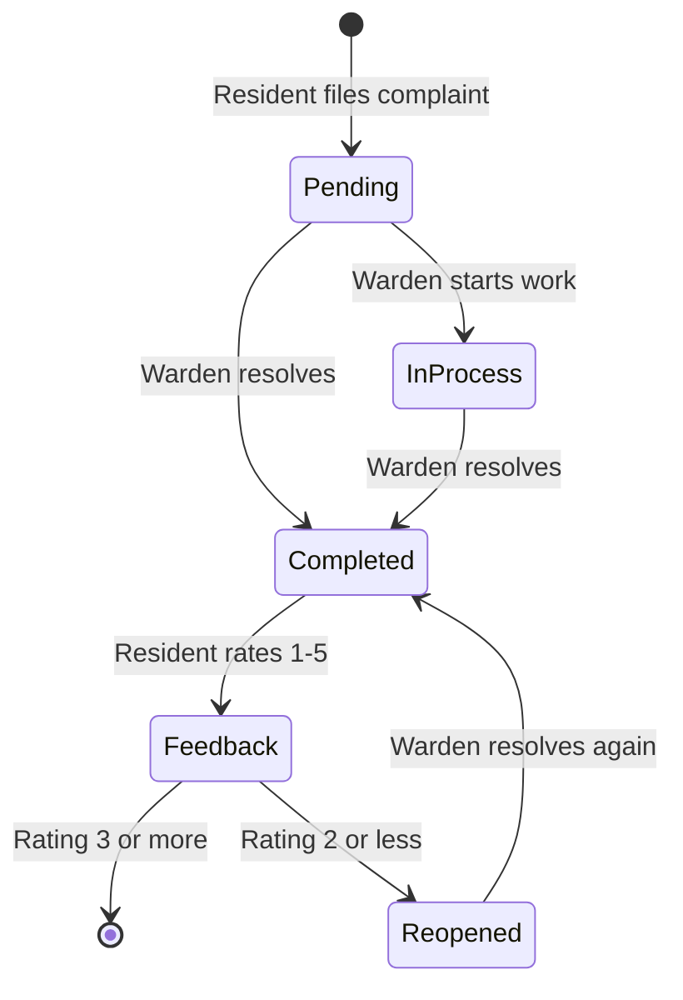

# 🏠 CB Grievances

A complaint management system for hostel residents, where they file complaints and track them, and the warden reviews and updates them.

Built with **Java, Spring Boot, Spring Security, Thymeleaf, MySQL and Bootstrap**.

## Screenshots

| Login | Resident dashboard |
|---|---|
|  |  |

| File a complaint | Warden dashboard |
|---|---|
|  |  |

## Features

**Resident**
- Register with a JNU email and log in
- File a complaint with a category, description and optional photo
- See all their complaints and current status
- Get a bell notification and an email when a complaint is resolved
- Give a star rating and comment on a completed complaint
- Reopen a complaint if the rating is low (2 or less)

**Warden**
- See all complaints, newest first
- Filter complaints by wing (Boys / Girls)
- Update complaint status (Pending, In Process, Completed, Reopened)
- See resident feedback next to each complaint

**General**
- Separate dashboards and access for resident and warden
- Passwords stored encrypted (BCrypt)
- Responsive Bootstrap design with a brown theme

## How it works



## Security

| Concern | What the app does |
|---|---|
| Passwords | Hashed with BCrypt, never stored in plain text |
| Roles | Role comes from the database, not the login form |
| Direct requests | Ownership, status and rating are checked on the server for every request |
| ID overwrite | `id` is cleared before saving, so a crafted request can't overwrite another row |
| Photo uploads | Random file names, JPG/PNG only, 5 MB limit, shown only to the owner or warden |
| Login errors | Same generic message for wrong password and wrong role |
| Secrets | Mail credentials read from environment variables |

## Tech stack

| Part | Technology |
|---|---|
| Backend | Java 21, Spring Boot, Spring Data JPA |
| Security | Spring Security |
| Frontend | Thymeleaf, Bootstrap 5, CSS |
| Database | MySQL |
| Build tool | Maven |

## How to run

**Requirements:** Java 21, Maven, MySQL

1. Clone the project:
   ```
   git clone https://github.com/aditi-srivastava1/cb-grievances.git
   ```
2. Create the database in MySQL:
   ```sql
   CREATE DATABASE cb_grievances_db;
   ```
3. Add your MySQL username and password in `src/main/resources/application.properties`.
4. (Optional) For email alerts, set the environment variables `MAIL_USERNAME`, `MAIL_PASSWORD` (an app password) and `MAIL_TEST_RECIPIENT`. The app works without them; only emails are skipped.
5. Run the project and open `http://localhost:8080`:
   ```
   mvn spring-boot:run
   ```

Tables are created automatically on the first run. A test warden account is also created at startup for testing.

## Project structure

```
src/main/java/com/cbgrievances/cb_grievances/
├── config/        Security setup and startup data
├── controller/    Handles web requests
├── model/         Resident, Warden, Complaint, Feedback, Notification
├── repository/    Database access
└── service/       Business logic

src/main/resources/
├── templates/     Thymeleaf HTML pages
└── static/css/    style.css
```

## Database

```
residents     (id, jnu_id, name, password, wing, room_number)
wardens       (id, username, name, password, wing)
complaints    (id, category, description, wing, date_filed, status, photo_file_name, resident_id)
feedbacks     (id, star_rating, comment, complaint_id)
notifications (id, resident_id, message, complaint_id, created_at, seen)
```

## Author

**Aditi Srivastava**
[GitHub](https://github.com/aditi-srivastava1)
